# EA Dashboard — User Documentation

> **Enterprise Architecture Dashboard** — A strategic IT landscape planning tool for mid-sized industrial enterprises.  
> This document describes all features grouped by stakeholder role, with references to the included demo data (*Metallwerk Vorarlberg GmbH*).

---

## Table of Contents

- [Getting Started](#getting-started)
- [Navigation & Layout](#navigation--layout)
- [For the CIO — Strategic Oversight](#for-the-cio--strategic-oversight)
  - [Dashboard](#dashboard)
  - [Executive Summary](#executive-summary)
  - [Budget Dashboard](#budget-dashboard)
  - [Strategy Roadmap](#strategy-roadmap)
  - [Conformity Scorecard](#conformity-scorecard)
- [For the Enterprise Architect — Landscape Governance](#for-the-enterprise-architect--landscape-governance)
  - [Domains & Capabilities](#domains--capabilities)
  - [Applications](#applications)
  - [TIME Quadrant](#time-quadrant)
  - [Capability–Application Matrix](#capabilityapplication-matrix)
  - [Integration Map](#integration-map)
  - [Maturity Gap Analysis](#maturity-gap-analysis)
  - [Capability Investment Analysis](#capability-investment-analysis)
  - [Risk & Compliance](#risk--compliance)
  - [Data Quality Dashboard](#data-quality-dashboard)
  - [Scenario Planner](#scenario-planner)
- [For the PMO — Project & Demand Management](#for-the-pmo--project--demand-management)
  - [Project Portfolio](#project-portfolio)
  - [Project Heatmap](#project-heatmap)
  - [Dependency Graph](#dependency-graph)
  - [Resource Overlaps](#resource-overlaps)
  - [Demand Backlog](#demand-backlog)
  - [Demand Pipeline](#demand-pipeline)
- [For Business Stakeholders — Reference Data & Processes](#for-business-stakeholders--reference-data--processes)
  - [Vendor Management](#vendor-management)
  - [Vendor Scorecard](#vendor-scorecard)
  - [E2E Processes](#e2e-processes)
  - [AI Use Cases](#ai-use-cases)
- [Cross-Cutting Features](#cross-cutting-features)
  - [Global Search](#global-search)
  - [Settings & Data Management](#settings--data-management)
- [Demo Data Overview](#demo-data-overview)

---

## Getting Started

The EA Dashboard is a standalone, zero-server web application. It runs entirely in the browser and persists all data in `localStorage`.

**To start using the application:**

1. Open `bebauungsplan.html` in any modern web browser (Chrome, Firefox, Edge, Safari).
2. The app ships with demo data for a fictional company, *Metallwerk Vorarlberg GmbH*. All features can be explored immediately.
3. No internet connection is required after the initial load (CDN resources are cached).

**First-time tips:**
- Use the **sidebar** on the left to navigate between views.
- On mobile devices, tap the **☰ menu button** in the header to open the sidebar.
- Use the **search bar** in the header to find any entity across the entire dataset.

---

## Navigation & Layout

The application uses a sidebar navigation organized into functional groups:

| Sidebar Section | Contains |
|----------------|----------|
| **Domains** | Domain list |
| **Applications** | Application list, TIME Quadrant, Integration Map |
| **Demand** | Demand Pipeline, Demand Backlog |
| **Projects** | Portfolio, Project Heatmap, Dependencies |
| **Misc** | Vendors, Entities, Vendor Scorecard, AI Use Cases |
| **Strategy** | Budget Dashboard, Risk & Compliance, Data Quality, Resource Overlaps, Scenario Planner, Strategy Roadmap, Executive Summary, E2E Processes, Maturity Gap, Cap-App Matrix, Capability Investment, Conformity Scorecard |

The **header bar** shows the current page title, a **global search** button, and the company name.

---

## For the CIO — Strategic Oversight

These views provide high-level KPIs, budget visibility, and strategic direction for executive leadership.

### Dashboard

**Route:** `/` (Home)

The main dashboard provides an at-a-glance overview of the entire IT landscape.

**What you see:**
- **KPI Cards** — Total counts for Domains, Capabilities, Applications, Vendors, Projects, Demands, Average Maturity, and Total Budget.
- **Management KPIs** — Five tracked KPIs with current value, target, trend indicator (↑ improving, → stable, ↓ declining), and progress bars. In the demo data these include Capability Coverage, Redundanz-Index, Architektur-Compliance, TIME Invest Ratio, and Roadmap Progress.
- **TIME Distribution** — Pie chart showing how applications are categorized (Tolerate, Invest, Migrate, Eliminate).
- **Average Maturity by Domain** — Bar chart comparing maturity levels across all business domains.
- **Project Status** — Traffic-light overview (green / yellow / red) of all projects.
- **Budget by Category** — Breakdown of project spending by Run/Pflicht, Innovation/Grow, etc.
- **Quick Lists** — Applications marked for elimination and projects that need attention (yellow/red status).

> **📸 Navigate to:** `#/` to see this view with demo data.

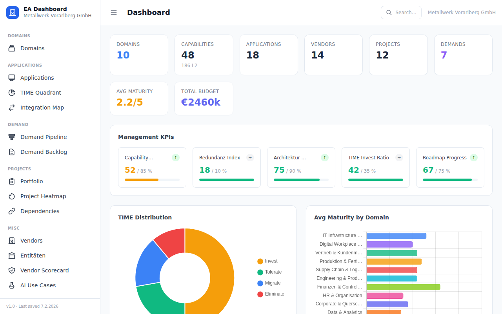

---

### Executive Summary

**Route:** `/executive-summary`

A print/PDF-ready management report combining the most important KPIs and findings into a single page.

**What you see:**
- **KPI Overview Cards** — Key metrics at a glance.
- **Project Status Ampel** — Traffic-light summary of all projects.
- **Budget Breakdown** — Budget by category with visual chart.
- **Management KPIs** — Target tracking with trend arrows.
- **Top 5 Projects by Budget** — Ranked list of the most expensive projects.
- **Top 5 Risks / Action Items** — Highest-priority risks and recommended actions.
- **Required Actions (Handlungsbedarf)** — Actionable recommendations derived from data analysis.
- **Application Landscape** — TIME distribution overview.
- **Maturity Overview** — Top maturity gaps requiring attention.

**Key action:** Click the **Print / PDF** button to export the report for board presentations.

> **📸 Navigate to:** `#/executive-summary` to see this view with demo data.

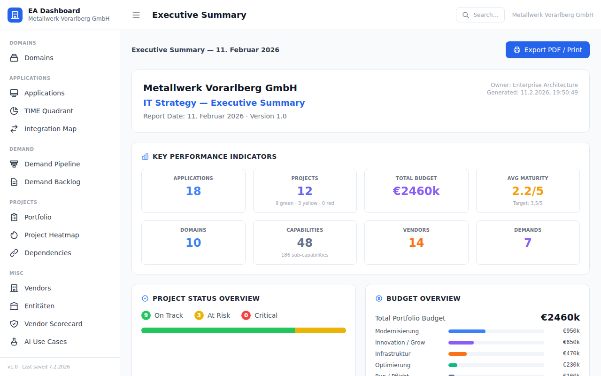

---

### Budget Dashboard

**Route:** `/budget-dashboard`

Provides financial visibility into IT spending for CIO and CFO discussions.

**What you see:**
- **KPI Cards** — Total Budget, Run Budget, Change Budget, Run/Change Ratio, Project Count, Average Budget per Project.
- **Run vs. Change** — Doughnut chart splitting budget into operational (Run/Pflicht) vs. innovation (Change/Grow) spending.
- **Costs by Domain** — Bar chart showing budget allocation per business domain.
- **Costs by Vendor** — Top 10 vendors ranked by contract value.
- **Costs by Application Type** — Doughnut chart (SaaS, On-Prem, Custom, PaaS).

> **📸 Navigate to:** `#/budget-dashboard` to see this view with demo data.

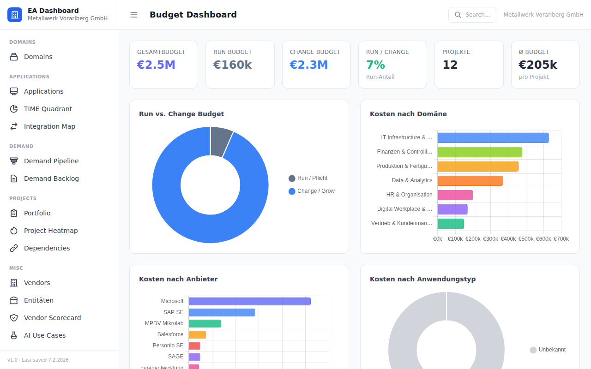

---

### Strategy Roadmap

**Route:** `/roadmap`

A Gantt-style timeline showing all projects along a quarterly axis.

**What you see:**
- **Timeline bars** — Each project is shown as a horizontal bar spanning its start-to-end dates.
- **Status indicators** — Color-coded dots (green / yellow / red) for project health.
- **Conformity badges** — Blue (Konform), Orange (Teilkonform), Red (Widerspricht) indicating EA alignment.
- **Milestone markers** — Diamond markers (◆) for project start and end dates.
- **Dependency arrows** — Lines connecting dependent projects.
- **Grouping** — Projects can be grouped by Domain, Category, or Status.
- **Filters** — Filter by project status or conformity rating.

**Key action:** Use the **Print** button to generate a roadmap handout.

> **📸 Navigate to:** `#/roadmap` to see this view with demo data.

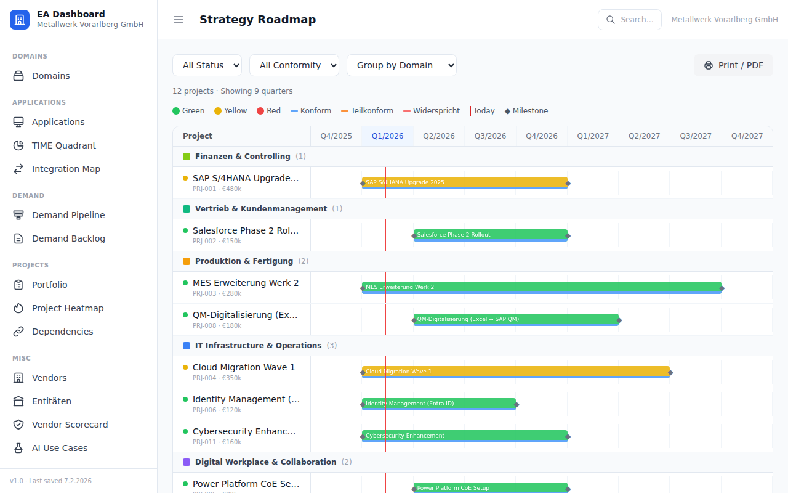

---

### Conformity Scorecard

**Route:** `/conformity-scorecard`

Measures how well projects align with enterprise architecture principles and strategy.

**What you see:**
- **KPI Cards** — Overall EA Conformity Score (%), counts of Conform, Partially Conform, and Contradicting projects.
- **Domain Conformity** — Per-domain breakdown with stacked bars (green = Konform, yellow = Teilkonform, red = Widerspricht) and a score percentage.
- **Conformity Distribution** — Donut chart summarizing the overall split.
- **Radar Chart** — Domain conformity scores (0–100%) on a radar plot for quick visual comparison.
- **Project Table** — All projects sorted by conformity status with color badges, domain, category, and budget.

> **📸 Navigate to:** `#/conformity-scorecard` to see this view with demo data.

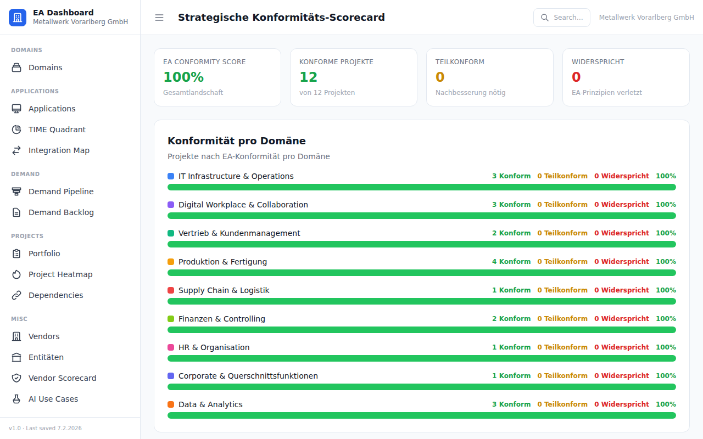

---

## For the Enterprise Architect — Landscape Governance

These views help enterprise architects manage the application landscape, analyze maturity, and govern technical debt.

### Domains & Capabilities

**Route:** `/domains` (list) · `/domains/:id` (detail)

**Domain List — What you see:**
- **Grid of domain cards** — Each card shows the domain name, color badge, capability count, and maturity progress bars.
- **Maturity summary** — Average Ist (current) and Soll (target) maturity per domain, plus the maturity gap.
- **App count** — Number of applications mapped to each domain's capabilities.

**Key action:** Click **Add Domain** to create a new business domain.

**Domain Detail — What you see:**
- **Domain header** — Name, color badge, description, owner.
- **KPI cards** — Capability count, Sub-Capability count, Average Maturity, Target Maturity, Mapped Apps.
- **Strategic Focus & Vision** — Description of the domain's strategic direction.
- **Key Applications** — Applications linked to this domain via capability mappings, with TIME quadrant badges.
- **Domain KPIs** — Custom KPIs with trend indicators and progress bars.
- **Capabilities table** — All L1 capabilities with Ist/Soll maturity bars, expandable sub-capabilities (L2).
- **Related E2E Processes** — Processes that span this domain.
- **Related Projects** — Projects targeting this domain.

**Key actions:** Click any capability to edit it. Use **Add Capability** to extend the domain model.

> **📸 Navigate to:** `#/domains` to see this view with demo data.

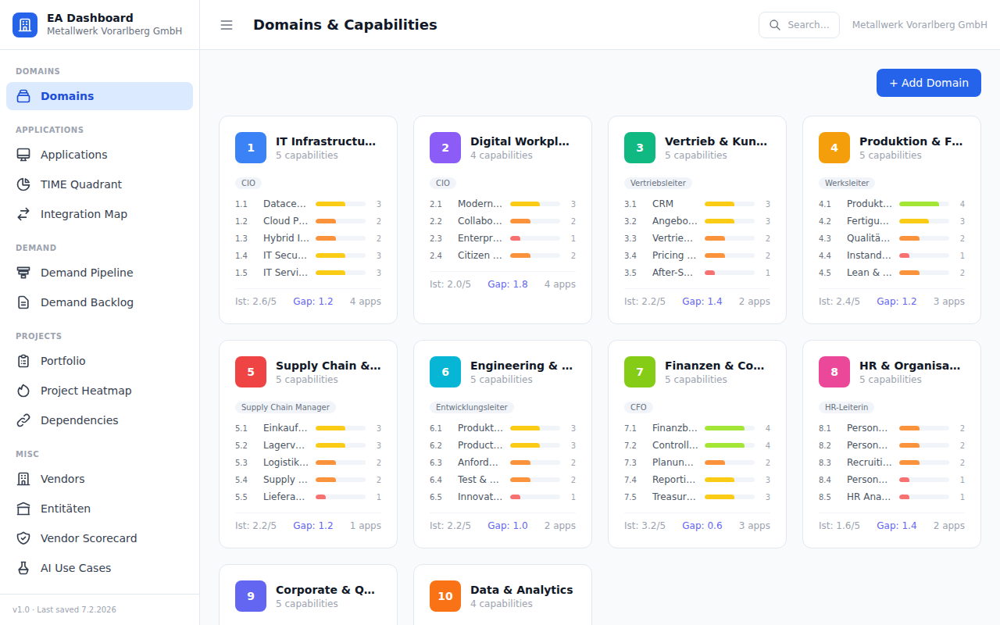

---

### Applications

**Route:** `/apps` (list) · `/apps/:id` (detail)

**Application List — What you see:**
- **Searchable, sortable table** — Search by name, vendor, category, or entity.
- **Filters** — Filter by TIME quadrant (Tolerate/Invest/Migrate/Eliminate), Criticality, or Entity.
- **Columns** — Name, Category, Criticality, TIME, Type (SaaS/On-Prem/Custom/PaaS), Cost/Year, User Count, Entity Count.
- **Total annual cost** — Sum displayed at the bottom.

**Application Detail — What you see:**
- **App profile header** — Name with TIME and Criticality badges, description.
- **Core attributes** — Cost/Year, User Count, Go-Live Date, Business Value (1–10), Technical Health (1–10), Business Owner, IT Owner.
- **Vendors** — Linked vendor(s) with roles.
- **Entities / Companies** — Legal entities using this application.
- **Capability Mappings** — Which business capabilities this application supports (grouped by domain, with Primary/Secondary role).
- **Related Projects** — Projects affecting this application (with action: ablösen / einführen / verändern).
- **E2E Processes** — Business processes that include this application.

**Key action:** Click **Add Application** to register a new system. Edit any field directly in the detail view.

> **📸 Navigate to:** `#/apps` to see this view with demo data.

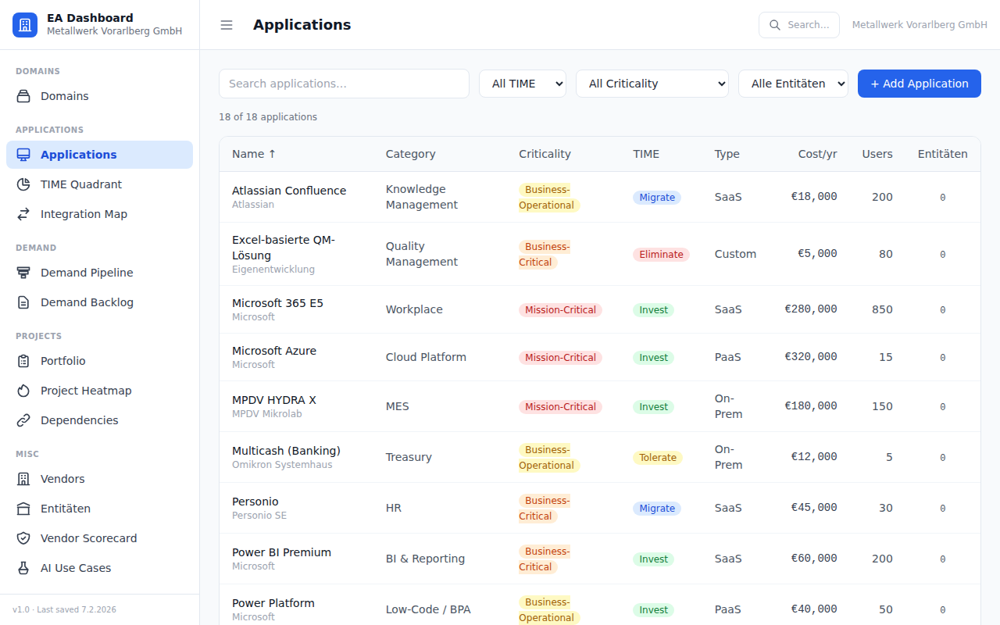

---

### TIME Quadrant

**Route:** `/time`

Visualizes the application portfolio using the TIME model (Tolerate, Invest, Migrate, Eliminate).

**What you see:**
- **Bubble chart** — Applications plotted by Technical Health (X-axis, 0–10) vs. Business Value (Y-axis, 0–10).
- **Bubble size** — Proportional to annual cost.
- **Color coding** — Green (Invest), Yellow (Tolerate), Blue (Migrate), Red (Eliminate).
- **Quadrant labels** — Background labels indicating each quadrant.
- **Side listing** — All apps grouped by TIME category.

**Use case:** Identify applications that are costly but provide low business value (candidates for elimination), or high-value systems that deserve further investment.

> **📸 Navigate to:** `#/time` to see this view with demo data.

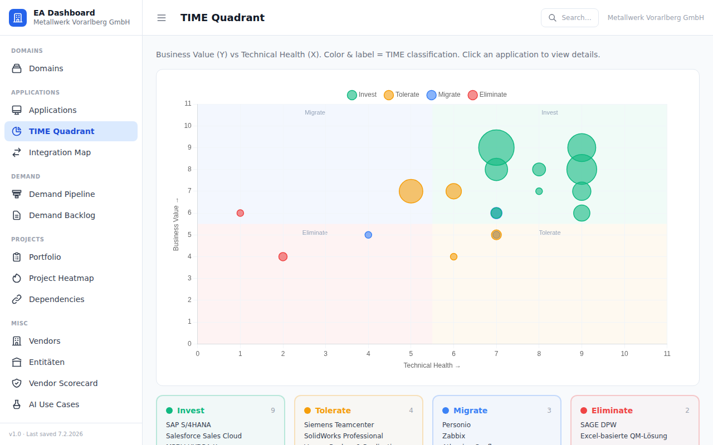

---

### Capability–Application Matrix

**Route:** `/capability-matrix`

An interactive heatmap showing which applications support which business capabilities.

**What you see:**
- **Matrix grid** — Rows are capabilities (grouped by domain), columns are applications.
- **Cell indicators** — ● (filled circle) = Primary mapping, ○ (hollow circle) = Secondary mapping.
- **Domain filter** — Focus on a specific domain.
- **Hide unmapped** — Option to hide applications that have no capability mappings.

**Key action:** Click any cell to toggle the mapping between an application and a capability. This is the primary tool for maintaining the capability–application relationship.

> **📸 Navigate to:** `#/capability-matrix` to see this view with demo data.

---

### Integration Map

**Route:** `/integration-map`

An interactive D3-based force-directed network graph showing application-to-application interfaces.

**What you see:**
- **Network diagram** — Applications as nodes, integrations as connections.
- **Node size** — Varies by the number of connections (more interfaces = larger node).
- **Connection count badges** — Numbers on each node.
- **Link colors** — By interface type: API (blue), File (orange), DB-Link (purple), Event (red), ETL (green), Manual (gray).
- **Legend** — Color key for interface types.
- **Zoom controls** — Zoom in/out and reset the view.
- **Filter options** — Filter by interface type or specific application.
- **Integration table** — Below the graph, a table listing all integrations with source, target, protocol, direction, frequency, data objects, and status.

**Key actions:** Add new integrations, edit existing ones, or delete them directly from the table. Drag nodes in the graph to rearrange the layout.

> **📸 Navigate to:** `#/integration-map` to see this view with demo data.

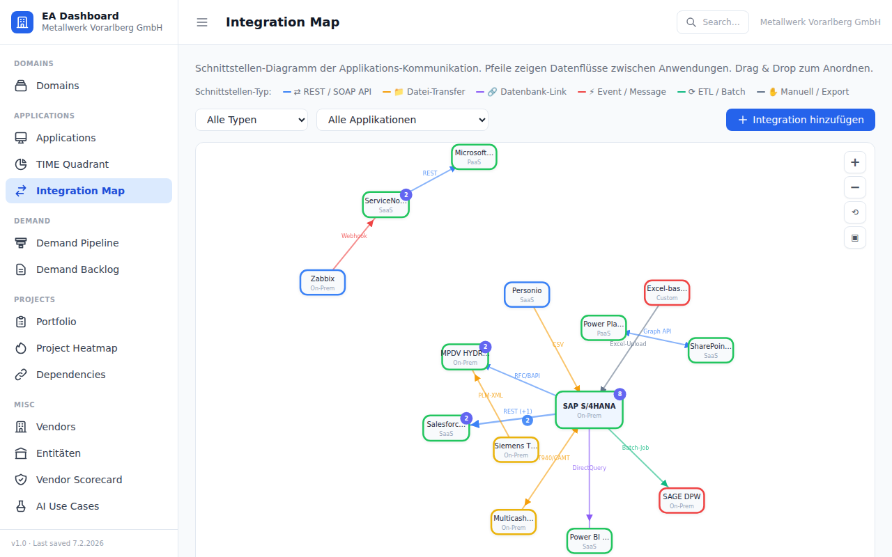

---

### Maturity Gap Analysis

**Route:** `/maturity-gap`

Identifies the gap between current (Ist) and target (Soll) maturity levels for each capability.

**What you see:**
- **Domain filter** — Buttons to filter by individual domain.
- **Summary cards** — Capability Count, Average Ist Maturity, Average Soll Maturity, Average Gap.
- **Horizontal bar chart** — Side-by-side bars showing Ist (blue) vs. Soll (purple) for each capability.
- **Top 15 Gaps table** — Capabilities sorted by gap size (Soll − Ist), color-coded by severity.

**Use case:** Focus investment on capabilities with the largest gap between current and target maturity.

> **📸 Navigate to:** `#/maturity-gap` to see this view with demo data.

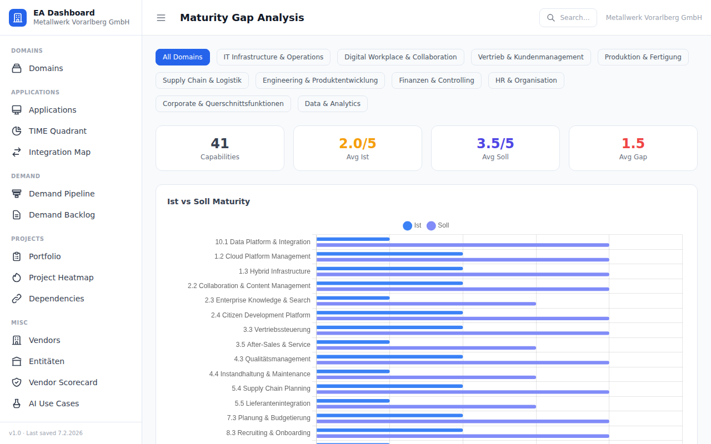

---

### Capability Investment Analysis

**Route:** `/capability-investment`

Analyzes how budget is distributed across capabilities and identifies underfunded areas.

**What you see:**
- **KPI Cards** — Total Budget, Capabilities with Investment, Underfunded count, Average Budget per Funded Capability.
- **Domain filter** — Buttons to narrow down to a specific domain.
- **Investment bar chart** — Horizontal bars showing budget per capability, sorted by amount.
- **Bubble chart** — Maturity Gap (X-axis) vs. Budget (Y-axis), bubble size = criticality. Capabilities in the lower-right quadrant have high maturity gaps but low budget — these are **underfunded**.
- **Underfunded Capabilities list** — High-criticality capabilities with large maturity gaps and no or low budget.
- **Investment detail table** — Capability, Domain, Criticality, Ist/Soll maturity, Gap, Budget, Linked Projects.

**Use case:** Answer "Are we investing in the right capabilities?" by cross-referencing maturity gaps with actual budget allocation.

> **📸 Navigate to:** `#/capability-investment` to see this view with demo data.

---

### Risk & Compliance

**Route:** `/risk-heatmap`

A risk assessment view combining probability × impact analysis with compliance indicators.

**What you see:**
- **Risk Heatmap** — 5×5 matrix (Probability: Sehr niedrig → Sehr hoch; Impact: Minimal → Kritisch). Applications are plotted in the appropriate cell.
- **High-Risk Apps count** — Applications in the red zone.
- **Shadow-IT Candidates** — Applications not mapped to any capability (potential shadow IT).
- **Vendor Risk** — Vendors with contracts expiring within 6 months.
- **End-of-Life Apps** — Applications marked as End-of-Life or End-of-Support.
- **Vendor Dependencies** — Single-vendor risks where critical apps rely on one vendor.
- **Lifecycle Status table** — Applications grouped by lifecycle status (Active, Planned, End-of-Support, End-of-Life).

**Use case:** Prioritize risk mitigation by focusing on applications in the upper-right quadrant (high probability, high impact).

> **📸 Navigate to:** `#/risk-heatmap` to see this view with demo data.

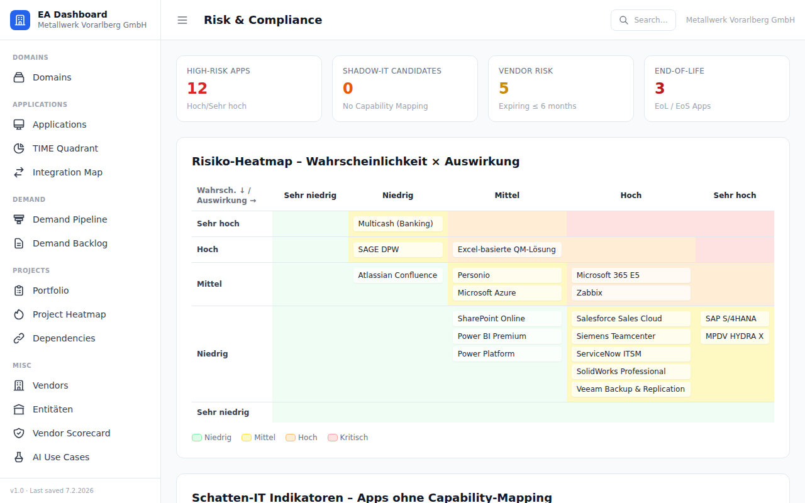

---

### Data Quality Dashboard

**Route:** `/data-quality`

Measures the completeness and consistency of the EA data model.

**What you see:**
- **Overall Quality Score** — Percentage (0–100%) based on data completeness checks.
- **Quality by Category** — Progress bars for: Applications, Capability Mapping, Vendors, Mapping Integrity, and Projects.
- **Incomplete Applications** — Applications missing key fields (cost, vendor, TIME quadrant, etc.).
- **Unmapped Capabilities** — Capabilities with no application mapping (white spots in the landscape).
- **Orphaned Vendors** — Vendors with no linked applications.
- **Orphaned Mappings** — Mappings referencing deleted or invalid entities.

**Use case:** Track data governance health and identify areas where data entry is incomplete.

> **📸 Navigate to:** `#/data-quality` to see this view with demo data.

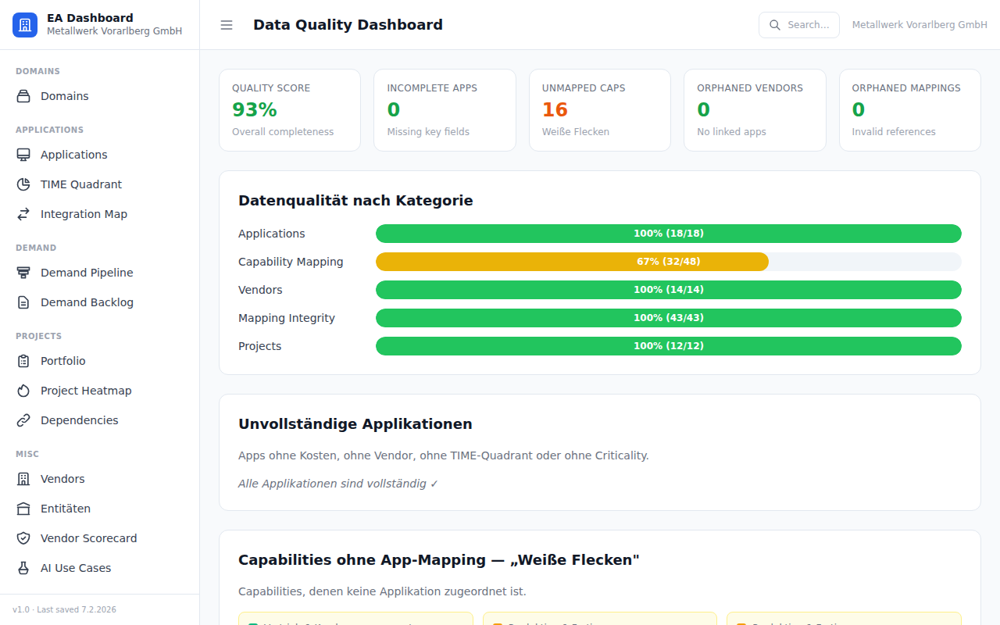

---

### Scenario Planner

**Route:** `/scenario-planner`

A what-if analysis tool for evaluating the impact of strategic decisions.

**What you see:**
- **Scenario type selector** — Choose between "Cancel a Project" or "Retire an Application".
- **Entity selector** — Pick the specific project or application to analyze.
- **Impact analysis results:**
  - For **Cancel Project**: Impact on maturity gaps, dependent projects (cascade), affected capabilities.
  - For **Retire Application**: Affected capabilities (with count of alternative apps), affected projects, affected processes, affected integrations.
- **Severity rating** — High / Medium / Low impact classification.
- **KPI impacts** — Summary of how key metrics would change.

**Key action:** Click **Save Scenario** to persist a scenario for later comparison. Saved scenarios are stored in `localStorage`.

**Use case:** Answer questions like "What happens if we cancel the SAP S/4HANA Upgrade?" or "What happens if we retire MPDV HYDRA X?"

> **📸 Navigate to:** `#/scenario-planner` to see this view with demo data.

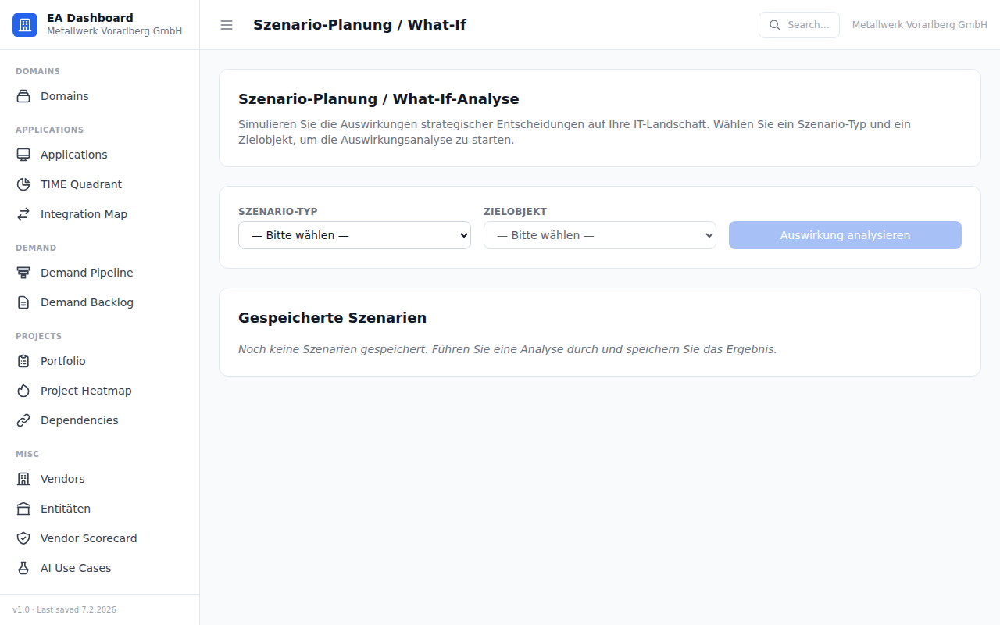

---

## For the PMO — Project & Demand Management

These views support project management offices in tracking initiatives, managing the demand pipeline, and identifying resource conflicts.

### Project Portfolio

**Route:** `/projects` (list) · `/projects/:id` (detail)

**Project List — What you see:**
- **Searchable, sortable table** of all projects.
- **Filters** — By Category (Run/Pflicht, Modernisierung, Optimierung, Innovation/Grow, Infrastruktur), Status (green/yellow/red).
- **Columns** — Name, Category, Domain (with color badge), Budget, Timeline (start → end), Sponsor, Dependency count.
- **Total filtered budget** — Sum at the bottom.

**Project Detail — What you see:**
- **Project header** — Status dot, name, category badge, timeline, status text.
- **KPI cards** — Budget, Primary Domain, Sponsor, Project Lead.
- **Strategic Contribution** — Description of the project's strategic alignment.
- **Affected Applications** — Applications changed by this project (with action: ablösen/einführen/verändern).
- **Dependencies** — Other projects this project depends on or that depend on it (with dependency type and description).
- **Touched Capabilities** — Capabilities that will be affected by the project.

**Key action:** Click **Add Project** to create a new project. Edit any field in the detail view.

> **📸 Navigate to:** `#/projects` to see this view with demo data.

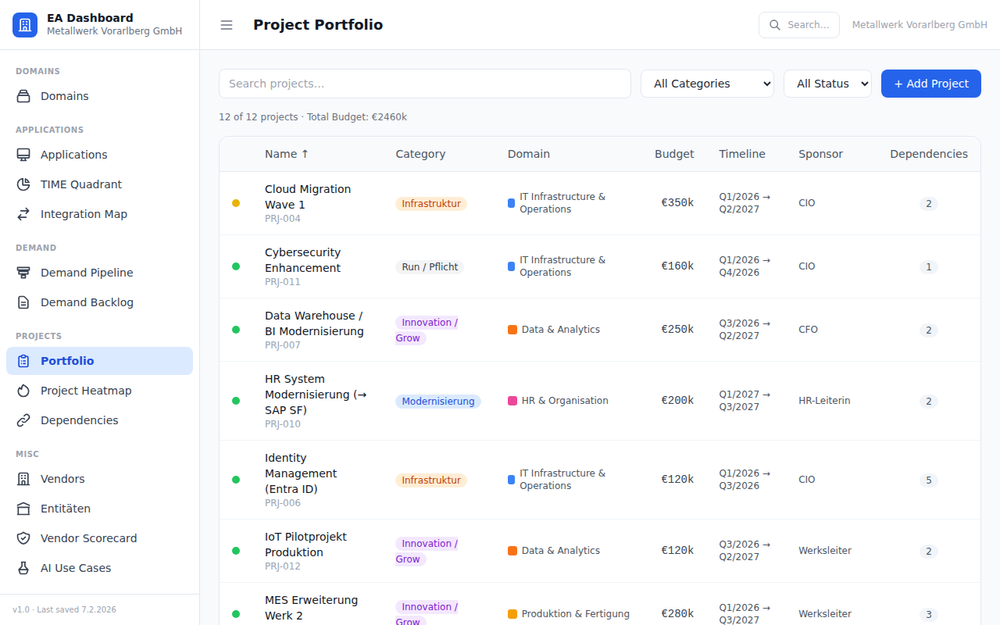

---

### Project Heatmap

**Route:** `/project-heatmap`

A matrix showing which domains are affected by which projects.

**What you see:**
- **Domain × Project grid** — Rows are domains, columns are projects.
- **Cell indicators** — "P" (Primary domain, dark color) or "S" (Secondary domain, lighter color).
- **Summary stats** — Most Active Domain, Total Projects, Cross-Domain Projects count, Domains without Projects count.

**Use case:** Quickly identify which domains are under high change pressure and which domains have no active projects.

> **📸 Navigate to:** `#/project-heatmap` to see this view with demo data.

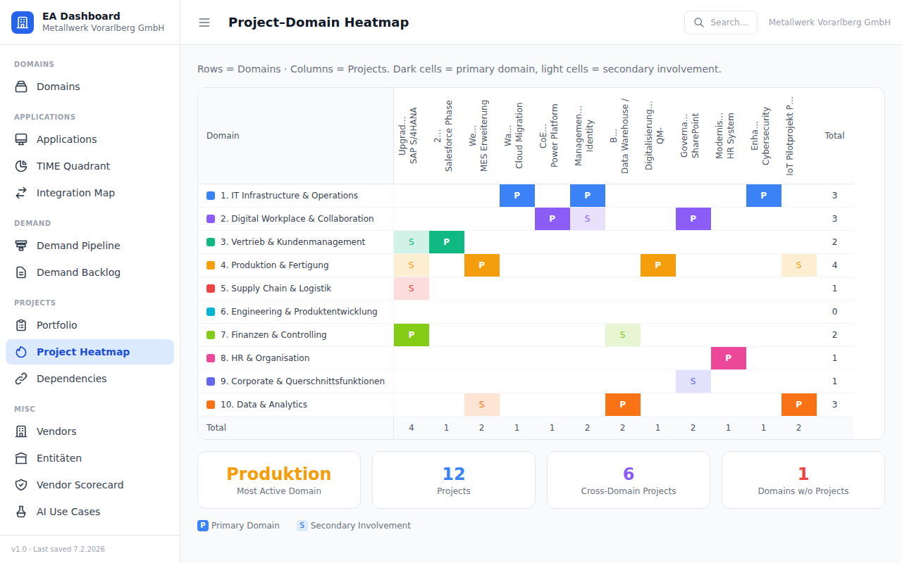

---

### Dependency Graph

**Route:** `/dependencies`

An interactive D3 force-directed graph showing project-to-project dependencies.

**What you see:**
- **Network graph** — Projects as nodes, dependencies as directed links.
- **Node size** — Varies by connection count.
- **Node border color** — Reflects project status (green / yellow / red).
- **Link colors** — By dependency type: T=Technisch (red), D=Daten (blue), P=Prozess (purple), R=Ressourcen (orange), F=Fachlich (green), Z=Zeitlich (gray).
- **Hover info** — Connection count and status for each project.
- **Zoom controls** — Zoom in/out and reset.
- **Dependency table** — Below the graph: Source, Type, Target, Description.

**Use case:** Identify critical-path projects that many others depend on, and detect circular dependencies.

> **📸 Navigate to:** `#/dependencies` to see this view with demo data.

---

### Resource Overlaps

**Route:** `/resource-overlaps`

Detects conflicts where multiple projects target the same applications or domains simultaneously.

**What you see:**
- **App Conflicts** — Applications affected by multiple projects at the same time.
- **Timeline Collisions** — Projects that overlap in time while modifying the same application.
- **Cross-Domain Complexity** — Projects spanning two or more domains, with a complexity score.
- **Critical Action Conflicts** — Applications being retired and modified simultaneously by different projects.

**Use case:** Prevent resource contention and coordinate timelines when multiple projects affect shared systems.

> **📸 Navigate to:** `#/resource-overlaps` to see this view with demo data.

---

### Demand Backlog

**Route:** `/demands` (list) · `/demands/:id` (detail)

**Demand List — What you see:**
- **Status summary cards** — Counts per status: Eingereicht, In Bewertung, Genehmigt, Abgelehnt, In Umsetzung, Abgeschlossen.
- **Searchable, filterable table** — Filter by Status, Category (Idee / <50k / >50k), Priority (Hoch / Mittel / Niedrig).
- **Columns** — Title, Category, Status, Priority, Estimated Budget, Request Date, Approval Checklist dots (Security ✓/✗, Legal ✓/✗, Architecture ✓/✗).
- **Total estimated budget** — Sum at the bottom.

**Demand Detail — What you see:**
- **Demand header** — Title, Status/Category/Priority badges, Requester, Request Date.
- **Core info** — Estimated Budget, Primary Domain, Approval Status, Business Case description.
- **AI Use Case section** — If applicable, shows the AI Risk Category (Minimal/Begrenzt/Hoch/Unannehmbares) with EU AI Act guidance.
- **Three approval checklists:**
  - **IT Security** — Data Classification, Access Control, Encryption Review, Vulnerability Scan.
  - **Legal** — Data Privacy, GDPR, Contract Review, License Check.
  - **Architecture** — Fits EA Strategy, Integration Review, Technology Approved, Scalability Check.
- Each checklist shows progress (%) and supports editable notes.
- **Related Apps / Vendors** — References to affected applications and vendors.

**Key action:** Click **Add Demand** to submit a new business request.

> **📸 Navigate to:** `#/demands` to see this view with demo data.

---

### Demand Pipeline

**Route:** `/demand-pipeline`

A Kanban-style pipeline view for tracking demand lifecycle from submission to project conversion.

**What you see:**
- **KPI Cards** — Total Demands, Pipeline Value (€), Approved Value (€), Conversion Rate (%), AI Use Cases count.
- **Kanban board** — Demands displayed as cards in status columns (Eingereicht → In Bewertung → Genehmigt → In Umsetzung → Abgeschlossen), with priority badges.
- **Convert to Project** — Button on approved demands to create a project with pre-filled data.
- **Pipeline Funnel chart** — Demand counts at each stage with conversion percentages between stages.
- **Throughput Analysis** — Average time (in days) demands spend in each status, average time to approval, average time to completion.

**Use case:** Track the demand-to-project conversion flow and identify bottlenecks in the approval process.

> **📸 Navigate to:** `#/demand-pipeline` to see this view with demo data.

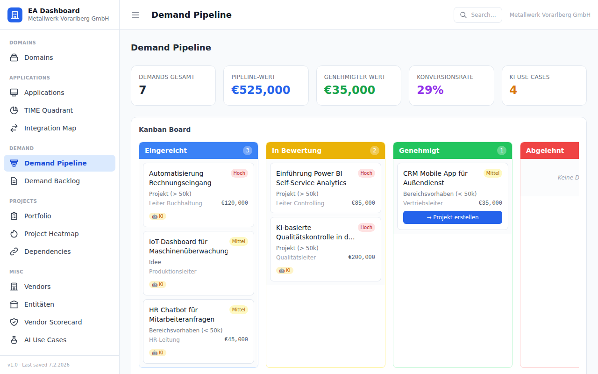

---

## For Business Stakeholders — Reference Data & Processes

These views manage supporting data and provide process-level visibility.

### Vendor Management

**Route:** `/vendors` (list) · `/vendors/:id` (detail)

**Vendor List — What you see:**
- **Searchable, sortable table** with filters by Status (Active/New/Under Review/Phase-Out), Criticality (Strategic/Important/Standard/Commodity), Vendor Type (MSP/HYP/INF/MKT/SAAS-I/SAAS-S/LIC/PBR).
- **Columns** — Vendor Name, Category, Vendor Type, Criticality, Status, Contract Value, Contract End, App Count.
- **Total contract value** — Sum at the bottom.

**Vendor Detail — What you see:**
- **Vendor profile** — Name, Status and Criticality badges, Vendor Type, Description.
- **KPI cards** — Contract Value/Year, Contract End, Service Level, Application Count.
- **Contact info** — Contact Person, Vendor Manager, Website, Rating (1–10).
- **Linked Applications** — All applications provided by this vendor with TIME quadrant and cost.

**Key action:** Click **Add Vendor** to register a new IT vendor or partner.

> **📸 Navigate to:** `#/vendors` to see this view with demo data.

---

### Vendor Scorecard

**Route:** `/vendor-scorecard`

Analyzes vendor dependency risk and health across the portfolio.

**What you see:**
- **KPI Cards** — Total Vendors (Strategic count), Concentration Risk (top vendor's share of Mission-Critical apps), Expiring Contracts (within 12 months), Total Contract Value.
- **Concentration Risk bars** — Percentage of Mission-Critical applications per vendor, highlighting single-vendor dependencies.
- **Contract Renewal Calendar** — Timeline of expiring contracts with days remaining, sorted by urgency.
- **Vendor Health Score** — A composite score (0–100) per vendor based on: app diversity, criticality ratio, contract tenure, and vendor rating.
- **Vendor Overview table** — Status, Criticality, App Count, Mission-Critical App Count, Contract Value, Contract End, Health Score.

**Use case:** Identify vendors that pose a concentration or contract risk, and prioritize vendor diversification.

> **📸 Navigate to:** `#/vendor-scorecard` to see this view with demo data.

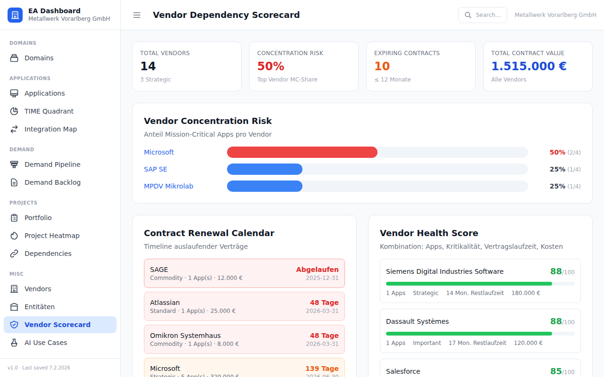

---

### E2E Processes

**Route:** `/processes` (list) · `/processes/:id` (detail)

**Process List — What you see:**
- **Table** of all end-to-end business processes.
- **Columns** — ID, Name, Owner, Status (active / optimization / transformation), Linked Domains (color squares), App Count, KPI Count.

**Process Detail — What you see:**
- **Process header** — ID, status badge, name, description, owner.
- **Linked Domains** — Color-coded pills showing which domains this process spans.
- **Involved Applications** — Applications supporting this process, derived automatically from capability mappings or linked directly.
- **Process KPIs** — Custom KPIs with trend indicators (↑ improving, → stable, ↓ declining) and progress bars toward targets.

**Key action:** Click **Add Process** to define a new end-to-end business process.

> **📸 Navigate to:** `#/processes` to see this view with demo data.

---

### AI Use Cases

**Route:** `/ai-usecases`

Lists all demands classified as AI use cases, categorized by EU AI Act risk levels.

**What you see:**
- **Risk Category summary cards** — Counts per risk level: Minimales Risiko, Begrenztes Risiko, Hohes Risiko, Unannehmbares Risiko.
- **Searchable, sortable table** — Filter by Risk Category, Status.
- **Columns** — 🤖 Use Case Title, Risk Category badge, Status, Priority, AI Description, Request Date.

**Use case:** Track AI adoption initiatives and ensure compliance with the EU AI Act risk framework.

> **📸 Navigate to:** `#/ai-usecases` to see this view with demo data.

---

## Cross-Cutting Features

### Global Search

**Route:** `/search` (also accessible via the search button in the header)

A full-text search across all entity types.

**What you see:**
- **Search input** — Type any keyword (e.g., "SAP", "Cloud", "Migration").
- **Grouped results** — Results appear grouped by type: Applications, Domains, Capabilities, Projects, Vendors, Processes, Demands.
- **Result cards** — Each result shows a type badge, name, detail info, ID, and a navigation arrow.

**Use case:** Quickly find anything related to a specific topic, vendor, or technology across the entire EA dataset.

---

### Settings & Data Management

**Route:** `/settings` (accessible via the gear icon in the sidebar)

**What you see:**
- **Dark Mode toggle** — Switch between light and dark themes.
- **Export Data** — Download the entire dataset as a JSON file for backup or sharing.
- **Import Data** — Upload a JSON file to replace the current dataset.
- **Reset to Seed Data** — Discard all changes and restore the demo data.
- **Data Statistics** — Counts of Domains, L1 Capabilities, L2 Sub-Capabilities, Applications, Mappings, Projects, Dependencies, and localStorage size.
- **About** — Version, Company, Owner, Last Updated, and technology stack.

---

## Demo Data Overview

The application ships with demo data for **Metallwerk Vorarlberg GmbH**, a fictional mid-sized industrial enterprise. This data is designed to demonstrate all features:

| Entity | Count | Examples |
|--------|-------|----------|
| **Domains** | 10 | IT Infrastructure & Operations, Produktion & Fertigung, Finanzen & Controlling |
| **Applications** | 18 | SAP S/4HANA, Salesforce Sales Cloud, MPDV HYDRA X, Microsoft 365 E5, Siemens Teamcenter |
| **Projects** | 12 | SAP S/4HANA Upgrade 2025, Salesforce Phase 2 Rollout, MES Erweiterung Werk 2 |
| **Vendors** | 14 | SAP SE, Microsoft, Siemens Digital Industries Software |
| **Demands** | 7 | Various business requests with different statuses and priorities |
| **Processes** | Multiple | End-to-end processes spanning multiple domains |
| **Management KPIs** | 5 | Capability Coverage, Redundanz-Index, Architektur-Compliance, TIME Invest Ratio, Roadmap Progress |

The demo data covers all lifecycle states, risk levels, maturity gaps, and budget categories to provide realistic examples for every view.

**To reset to demo data at any time:** Go to **Settings** → **Reset to Seed Data**.
